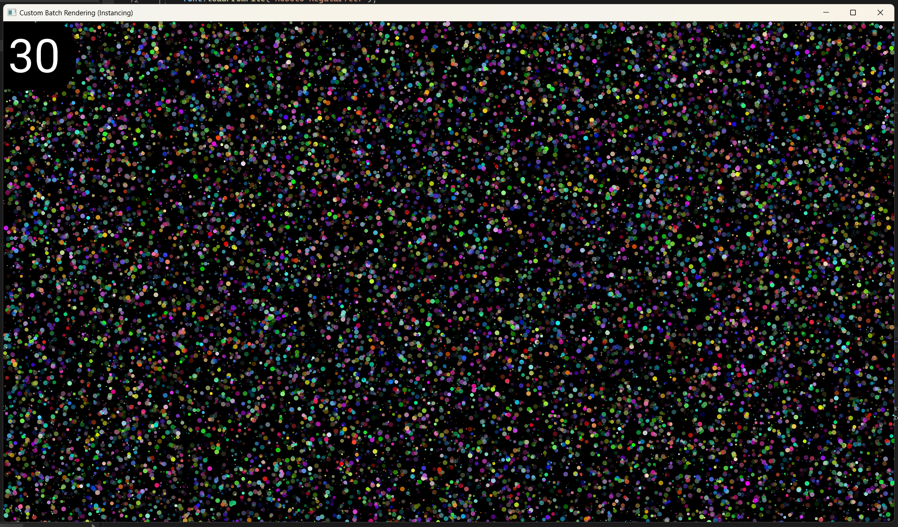
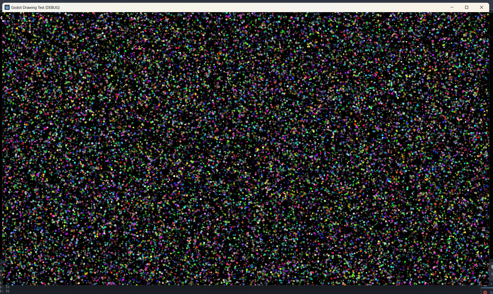
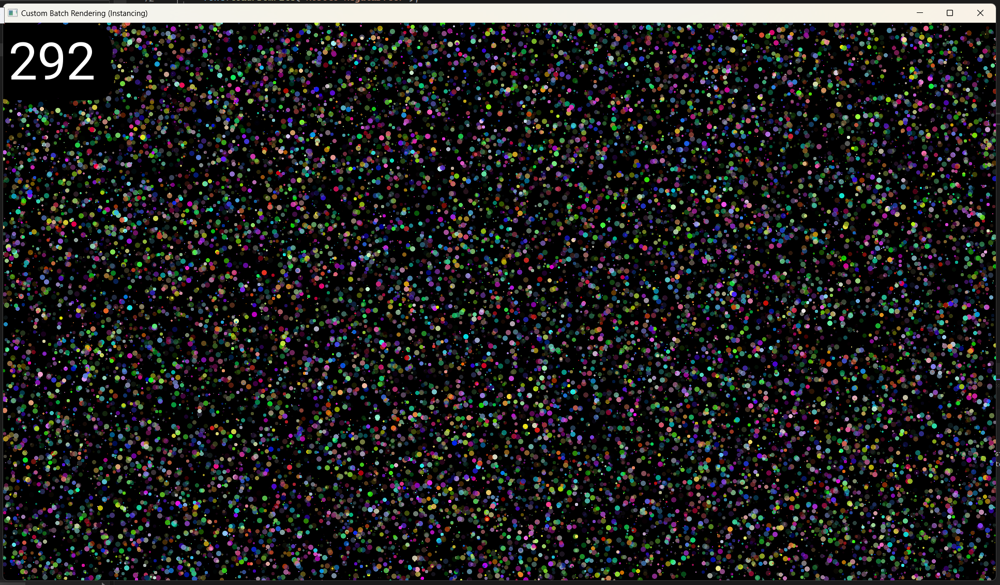
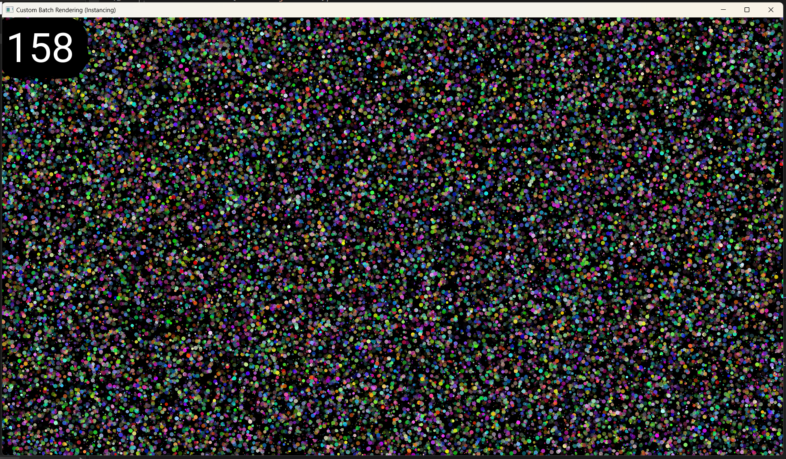

# Rendering Test
Project to test custom rendering, and how it can be **faster** than rendering provided by popular/industry-standard frameworks (for certain cases).

# Setup
I tested rendering lots of circles in godot, SFML, and my own rendering implementation (which uses OpenGL).

# Results
My own renderer can render **300,000** circles at 30 fps. SFML can only render **20,000**, and godot **50,000**. My renderer beats godot by **6 times** the amount of circles it can render at 30 fps. 

The reason why my renderer is better (for this *particular* case) is because it utilizes **batching and instancing**. Batching minimizes draw() calls (just one draw() call that draws all my circles instead of one draw() call per circle), and instancing minimizes GPU memory use (by consolidating shared attributes of the circles, i.e. the circle geometry/vertices). Both batching and instancing essentially reduce the amount of cpu->gpu communication that has to occur, which is slow. Specifically, batching tackles cpu->gpu latency, and instancing tackles cpu->gpu throughput.

# Lesson
The lesson here is, that **custom solutions** ("reinventing the wheel") can sometimes be beneficial not just for learning, but actual performance. Often libraries are generalized to provide decent performence for a wide variety of cases, which hurts their performance in specialized cases.

# Pictures
Let's compare the visual output of each renderer. The background color (clear color) is black for all of them. So the less black you see, the more circles are being drawn. The circles are 1-5 pixels in radius.

Here is SFMl rendering 20,000 circles at ~30 fps:

Here is Godot rendering 50,000 circles at ~30 fps (the fps counter in my Godot implementation is in **stdout**, look at at the very bottom-left of the image):

Here is my renderer rendering 300,000 circles at ~30 fps:

You see almost no black, that is because the huge amount of circles is covering the entire screen, and in fact cover the screen *several times*. 

Just so you don't think I'm cheating, here is the output of my renderer drawing only 20,000 circles (same as SFML's max), look at the fps!

And here is my renderer drawing 50,000 circles (Godot's max), again, check out the fps!

